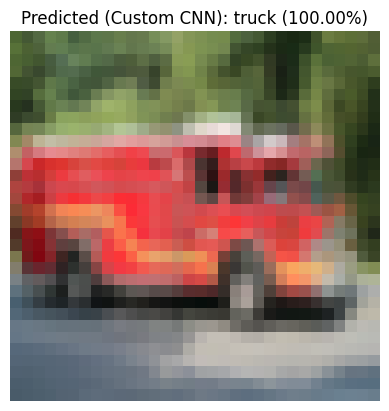

# 🚀 CIFAR-10 CLASSIFICATION: Custom CNN vs. Transfer Learning (MobileNetV2)

## Project Overview

This project establishes a high-accuracy classification baseline for the CIFAR-10 dataset by comparing two distinct deep learning approaches: a **Custom Convolutional Neural Network (CNN)** trained from scratch, and **MobileNetV2** leveraging **Transfer Learning**. The goal was to quantify the performance gain from transfer learning while critically analyzing its robustness to low-resolution image input.

| Metric                       | Custom CNN (Baseline)                         | MobileNetV2 (Transfer Learning)                                                |
| :--------------------------- | :-------------------------------------------- | :----------------------------------------------------------------------------- |
| **Peak Validation Accuracy** | **88.63%**                                    | **~92.00%**                                                                    |
| **Key Insight**              | More reliable on native low-resolution noise. | Superior overall performance, but fails catastrophically on extreme upscaling. |

---

## 📂 Project Structure

This repository contains the full code, trained models (tracked via **Git LFS**), and critical test images:

```
.
├── test_images/
│   ├── airplane_test.jpg
│   ├── cat_test.jpg
│   ├── truck_9_sample.png
│   ├── output-CNN-cat.png
│   ├── output-CNN-truck.png
│   ├── output-MobileNetV2-cat.png
│   └── output-MobileNetV2-truck.png
├── .gitattributes # Git LFS configuration
├── cifar10_custom_cnn_baseline_88.63pct.keras  # tracked via Git LFS
├── best_mobilenetv2_cifar10_weights.weights.h5  # tracked via Git LFS
├── Custom_CNN.ipynb
└── MobileNetV2.ipynb

```

> ⚠️ **Note:** The `.h5` and `.keras` files are large and tracked with **Git LFS**. Make sure you have Git LFS installed to clone or pull these files properly.

---

## 🔎 Critical Finding: The Low-Res Domain Gap

The most significant finding was the difference in how each model handled the data distribution. While MobileNetV2 achieved a higher average accuracy (~92%), it suffered a catastrophic failure on specific low-resolution images, demonstrating the limits of feature transfer.

|      Model      |        Prediction Output       |  Confidence |                             Result                            |
| :-------------: | :----------------------------: | :---------: | :-----------------------------------------------------------: |
|  **Custom CNN** | **Predicted: truck (100.00%)** | **100.00%** |       **SUCCESS:** Highly confident correct prediction.       |
| **MobileNetV2** |     Predicted: cat (74.98%)    |    74.98%   | **FAILURE:** Severe misclassification due to domain mismatch. |

|                   Custom CNN Result (Correct)                  |                      MobileNetV2 Result (Incorrect)                     |
| :------------------------------------------------------------: | :---------------------------------------------------------------------: |
|  |  |

**Insight:** The superior features of MobileNetV2 were severely degraded by the noise (blockiness and blur) introduced when upscaling the `32 × 32` images. This shows that **domain-specific training** (like the Custom CNN) can be more reliable than complex transfer learning for highly constrained, low-resolution data.

---

## 💡 Validation: High-Resolution Success

When tested with a clean, high-quality image that did not contain upscaling artifacts, both models performed perfectly, proving the overall power of the MobileNetV2 base.

|      Model      | Prediction Output (Cat Image) | Confidence |
| :-------------: | :---------------------------: | :--------: |
|  **Custom CNN** |    Predicted: cat (99.82%)    |   99.82%   |
| **MobileNetV2** |    Predicted: cat (99.91%)    | **99.91%** |

|               High-Res Input (Original)               |             MobileNetV2 Predicted Cat (Highest Confidence)            |
| :---------------------------------------------------: | :-------------------------------------------------------------------: |
|  |  |

---

## 🛠️ Setup and Dependencies

```bash
# Recommended environment setup
conda create -n tf-env python=3.9
conda activate tf-env

# Install core dependencies
pip install tensorflow keras matplotlib numpy Pillow

# Ensure Git LFS is installed
git lfs install
```

---

## 📸 Using Your Own Images for Prediction

You can test your own images with the pretrained models provided in this repository (tracked via Git LFS).

### 1. Load the Saved Models

```python
import tensorflow as tf
from tensorflow import keras

# Load the Custom CNN model
custom_cnn = keras.models.load_model("cifar10_custom_cnn_baseline_88.63pct.keras")

# Load the MobileNetV2 model with weights
mobilenetv2 = keras.applications.MobileNetV2(weights=None, classes=10, input_shape=(32, 32, 3))
mobilenetv2.load_weights("best_mobilenetv2_cifar10_weights.weights.h5")
```

### 2. Preprocess Your Image

```python
from tensorflow.keras.preprocessing import image
from tensorflow.keras.applications.mobilenet_v2 import preprocess_input
import numpy as np

# Load and preprocess your image
img_path = "path_to_your_image.jpg"  # replace with your image path
img = image.load_img(img_path, target_size=(32, 32))
img_array = image.img_to_array(img)
img_array = np.expand_dims(img_array, axis=0)

# For Custom CNN → simple normalization
cnn_input = img_array / 255.0

# For MobileNetV2 → use model-specific preprocessing
mobilenet_input = preprocess_input(img_array.copy())
```

### 3. Run Predictions

```python
# Predict with Custom CNN
cnn_pred = custom_cnn.predict(cnn_input)
print("Custom CNN Prediction:", np.argmax(cnn_pred), "with confidence", np.max(cnn_pred))

# Predict with MobileNetV2
mobilenet_pred = mobilenetv2.predict(mobilenet_input)
print("MobileNetV2 Prediction:", np.argmax(mobilenet_pred), "with confidence", np.max(mobilenet_pred))
```

> CIFAR-10 classes are: `[airplane, automobile, bird, cat, deer, dog, frog, horse, ship, truck]`

---

## 🚀 Future Work

This project is a successful foundation for the next challenge: **Object Detection**.
The skills acquired in transfer learning, fine-tuning, and diagnosing input domain mismatches are directly applicable to optimizing models like **YOLO** or **SSD**.
